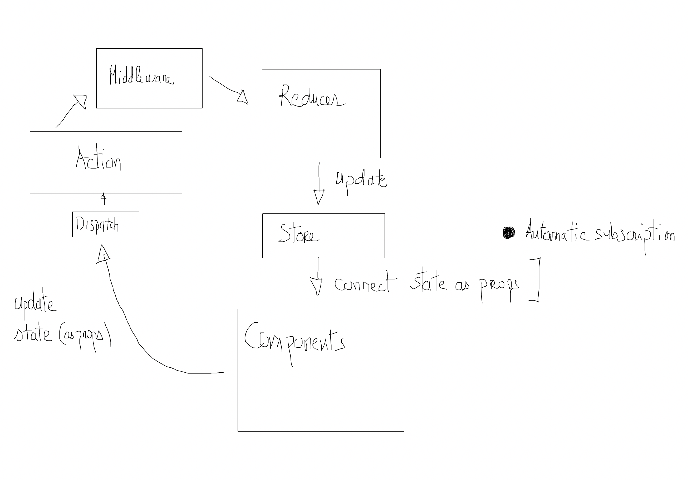

# Redux avancé

## Combine reducer

Dans une application on découpe souvent l'algorithmique en plusieurs stores. Redux fournit une méthode **CombineReducer** qui permet de "combiner plusieurs reducers".

Supposons que l'on ait deux reducers a et b, alors vous pouvez définir dans votre dossier reducers un fichier index.js et combiner les reducers comme suit :

```js
import { combineReducers } from 'redux';

import a from './a';
import b from './b';

export default combineReducers({
    aRdecuer : a,
    bReducer : b
});

```

Si vous utilisez create-react-app, vous importerez le fichier **index.js** dans votre fichier de bootstrap, fichier index.js à la racine de votre application. Le "combine reducer" se récupère comme un reducer classique :

```js

import { createStore } from 'redux';
import { Provider } from 'react-redux';
// Combine Reducer
import reducer from './reducers/index';

const store = createStore(reducer);

ReactDOM.render(
<Provider store={store}>
    <App />
</Provider>
, document.getElementById('root'));

```

## Comment utilisez le store d'un combine reducer

Dans la lecture des props dans un composant, il faudra faire attention à sélecionner le bon store. Dans l'exemple que nous avons donné dans le cours pour lire le store a ou b vous devrez écrire :

```js

const { a, b } = useSelector(state => {

  return {
    a : state.aRdeucer,
    b : state.bReducer
  }
})

```

## Exercice d'application Dragon

1. Reprendre le projet précédent sur les Dragons. Créez un reducer log il permettra de notifier la création et la suppression des dragons. Vous pouvez utiliser moment JS pour la gestion des dates dans votre partie log.

2. Ajoutez un bouton permettant de supprimer tous les logs.

3. Créez un nouveau reducer pour ajouter des chevaliers. Vous afficherez la liste des chevaliers à côté de la liste des dragons. Vous créez un nouveau champ sous le champ de saisi des dragons pour les chevaliers. Dans cette gestion vous mettrez en place l'ajout et la suppression des chevaliers.

4. (facultatif) Mettez en place la possibilité d'associer un chevalier à un dragon. Un chevalier ne peut avoir au plus qu'un dragon.

## Middleware

Les middlewares se trouvent, ensemble de fonction(s), entre l'envoie (dispatch) et les réduceurs (reducers). Nous pouvons donc techniquement modifier les actions distribuées avant qu'ils arrivent aux réduceurs, ou exécuter une fonctionnalités lors de ce processus.



\newpage

### Middleware signature

Voici la signature d'un middleware :

```js
const customMiddleware = store => next => action {

}
```

Cette fonction fonction reçoit le store elle retourne une fonction qui reçoit les next. Ici (dans la partie next) nous pouvons donc décider d'envoyer d'autre(s) action(s) à un reduceur (ou un autre middleware). Cette dernière fonction retournera également l'action en cours de dispatching.

### remarque

Une telle fonction est une fonction renvoyant une autre fonction. Voici un exemple en JS

```js
const myFunc = a => b => a + b ;

// Retournera 20
myFunc(10)(10)
```

## Middleware thunk

Si on a une action asynchrone comme suit, redux ne la gère pas nativement. Redux est synchrone, si on souhaite traiter une action asynchrone il faut utiliser le middleware : **thunk**.

Imaginons la problématique suivante :

```js
const FETCH_SCORE = 'FETCH_SCORE';

export const  fetch_score = () => {
  return {
    type: FETCH_SCORE,
  };
}

// passer par les props de votre composant pour déclencher cet action
export const fetchAsync = () => {

   return dispatch => {
        setTimeout(() => {
        dispatch(fetch_score()); // Dispatch asynchrone gérer par Redux
        }, 1000);
  };
}
```

- Installez le middleware suivant :

```bash
npm install redux-thunk
```

Puis, dans React dans le fichier **index.js** vous l'installez comme suit, une fois cette configuration réalisé vous pourrez gérer un dispatch asynchrone comme fetchAsync ci-dessus :

```js
import React from 'react';
import ReactDOM from 'react-dom';
import './index.css';
import App from './App';

import * as serviceWorker from './serviceWorker';

// Redux avec le middleware 
import { createStore, applyMiddleware } from 'redux';

// thunk permet la gestion de l'asynchrone dans Redux
import thunk from 'redux-thunk';

import { Provider } from 'react-redux';
import reducer from './reducers/index';

const store = createStore(reducer, applyMiddleware(thunk) );
// console.log(store.getState())

// On passe le store à l'application composant racine
ReactDOM.render(
<Provider store={store}>
    <App />
</Provider>
, document.getElementById('root'));

// If you want your app to work offline and load faster, you can change
// unregister() to register() below. Note this comes with some pitfalls.
// Learn more about service workers: https://bit.ly/CRA-PWA
serviceWorker.unregister();
```
## Exercice d'application Dragon

1. Ajoutez une action dans actions-types.js permettant de gérer une horloge. Elle se déclenchera au chargement de l'application.

2. Refactorez les logs en créant un middleware. Vous pouvez créer une branch avec Git refactoring.

## Exercice fecth score

Installez un projet React avec Redux, créez un store uniquement pour lire des scores, dans ce but vous créerez l'action FETCH_SCORE qui permettra la récupération des données.

Créez une base de données game dans firebase, puis dans cette base de données créez le document scores suivant :

```json
{
  "scores": [
    {
       "score" : 19
    },
   {
       "score" : 10
    },
     {
       "score" : 20
    },
     {
       "score" : 17
    }
  ]
}
```

Créez une application qui affichera les scores des utilisateurs en les récupérant depuis la base de données game.
